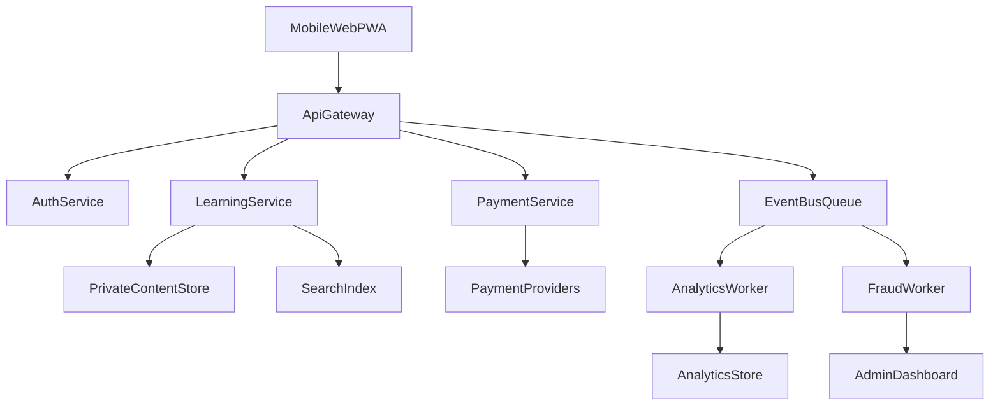
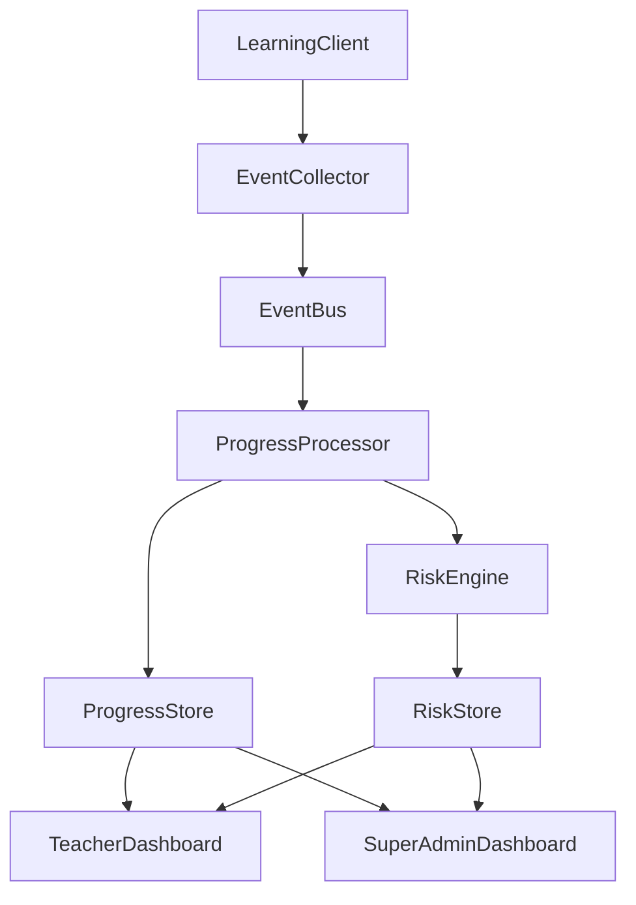

# Software Requirements Specification (SRS)

## Paid Books Learning System

## 1. Document Control

- **Project:** Paid Books Learning System
- **Prepared by:** Muhammad Wasim
- **Course:** Software Engineering - System Design
- **Version:** 1.0
- **Date:** 2026

### 1.1 Revision History

| Version | Date | Author | Changes |
| --- | --- | --- | --- |
| 0.1 | 2026-01-01 | Muhammad Wasim | Initial draft based on concept outline |
| 1.0 | 2026-04-26 | Muhammad Wasim | Complete SRS with functional, security, mobile, and operations requirements |

### 1.2 Definitions and Abbreviations

- **SRS:** Software Requirements Specification
- **RBAC:** Role-Based Access Control
- **2FA:** Two-Factor Authentication
- **JWT:** JSON Web Token
- **HLS:** HTTP Live Streaming
- **CDN:** Content Delivery Network
- **PII:** Personally Identifiable Information
- **SLA:** Service Level Agreement

## 2. Introduction

The Paid Books Learning System is a secure digital learning platform that provides paid educational content such as notes, voice-over notes, animations, and videos. The platform ensures authorized access only, while protecting intellectual property through layered security and content protection controls.

## 3. System Objectives

- Provide secure paid content access to verified users.
- Allow teachers to upload and manage structured multimedia learning content.
- Enable super admin governance, monitoring, and policy enforcement.
- Protect content from unauthorized access, leakage, and piracy.
- Deliver a mobile-first experience that works reliably across modern devices.

## 4. Scope

The system includes web-based interfaces, backend APIs, secure content delivery, payment integration, analytics dashboards, and audit/monitoring capabilities for students, teachers, and super admins.

Out-of-scope for this version:

- Native Android/iOS apps
- Offline download mode for paid video content
- Marketplace for third-party instructors outside admin-approved onboarding

## 5. Stakeholders and User Roles

### 5.1 Stakeholders

- Students (paid learners)
- Teachers (content creators)
- Super Admins (platform operators)
- Finance/Operations reviewers

### 5.2 Role Permissions Matrix

| Capability | Student | Teacher | Super Admin |
| --- | --- | --- | --- |
| Register/Login | Yes | Yes | Yes |
| Browse catalog | Yes | Yes | Yes |
| Purchase course/book | Yes | No | No |
| Access purchased content | Yes | No | Optional |
| Create course | No | Yes | Yes |
| Publish/Unpublish course | No | Yes (own) | Yes (all) |
| Moderate course/content | No | No | Yes |
| Manage users/roles | No | No | Yes |
| View own analytics | Yes | Yes | Yes |
| View full system revenue | No | Limited | Yes |
| Access audit/security logs | No | No | Yes |

### 5.3 Role Restrictions

- **Student:** Cannot create or modify course content.
- **Teacher:** Cannot access other teachers' private drafts without permission.
- **Super Admin:** Actions are fully logged and require elevated authorization for sensitive operations.

## 6. Assumptions and Constraints

- Stable internet is required for streaming and payment processing.
- Third-party payment gateways and cloud services may have occasional downtime.
- HTTPS is mandatory in all non-local environments.
- Legal and policy constraints apply to media ownership and content licensing.

## 7. Functional Requirements

Each requirement has a unique ID and acceptance criteria for testability.

### 7.1 Authentication and Authorization

- **FR-001:** User registration with email or phone.
  - **Acceptance Criteria:** New user receives verification prompt; account remains restricted until verification.
- **FR-002:** Secure login/logout for all roles.
  - **Acceptance Criteria:** Successful login issues valid session/JWT; logout invalidates token/session.
- **FR-003:** Password reset via verified channel.
  - **Acceptance Criteria:** Reset token/link expires and cannot be reused.
- **FR-004:** Optional 2FA for users.
  - **Acceptance Criteria:** If 2FA is enabled, login requires second factor.
- **FR-005:** RBAC-enforced route and action control.
  - **Acceptance Criteria:** Unauthorized role access attempts return 403 and are logged.

### 7.2 Student Module

- **FR-006:** Browse and search courses/books.
  - **Acceptance Criteria:** Students can filter by category, teacher, and price.
- **FR-007:** Purchase course/book and confirm payment status.
  - **Acceptance Criteria:** Successful payment creates order record and grants access.
- **FR-008:** Access only purchased/active subscription content.
  - **Acceptance Criteria:** Non-purchased content shows locked state and upgrade CTA.
- **FR-009:** Track lesson progress and completion.
  - **Acceptance Criteria:** Progress state persists across sessions and devices.
- **FR-010:** Handle access expiration.
  - **Acceptance Criteria:** Expired access disables premium content and shows renewal option.

### 7.3 Teacher Module

- **FR-011:** Create, edit, and manage courses.
  - **Acceptance Criteria:** Teacher can save draft, preview, and publish own course.
- **FR-012:** Upload notes, voice-over notes, animations, and videos.
  - **Acceptance Criteria:** Supported file types upload successfully with validation feedback.
- **FR-013:** Organize curriculum hierarchy (course -> section -> lesson).
  - **Acceptance Criteria:** Ordering changes are reflected in student view.
- **FR-014:** View engagement analytics for own content.
  - **Acceptance Criteria:** Dashboard shows enrollments, completion rates, and watch time summaries.

### 7.4 Super Admin Module

- **FR-015:** Manage users and role assignments.
  - **Acceptance Criteria:** Admin can create, suspend, activate, and role-update users with audit trail.
- **FR-016:** Moderate and approve/reject content.
  - **Acceptance Criteria:** Moderation state changes are visible to teacher and logged.
- **FR-017:** Monitor payments, refunds, and disputes.
  - **Acceptance Criteria:** Admin dashboard includes transaction statuses and exception flags.
- **FR-018:** Configure platform policies and security settings.
  - **Acceptance Criteria:** Settings updates take effect per scope and are version logged.

### 7.5 Payment and Subscription Module

- **FR-019:** Integrate Stripe, JazzCash, and EasyPaisa.
  - **Acceptance Criteria:** Gateway selection and payment completion flow are operational.
- **FR-020:** Process order lifecycle (pending/success/failed/refunded).
  - **Acceptance Criteria:** Each state transition is timestamped and traceable.
- **FR-021:** Generate invoice/receipt for successful purchases.
  - **Acceptance Criteria:** Receipt includes order ID, amount, date, and user details.
- **FR-022:** Process webhook events safely and idempotently.
  - **Acceptance Criteria:** Duplicate webhook deliveries do not duplicate orders/access.

### 7.6 Dashboards and Reporting

- **FR-023:** Student dashboard for enrolled courses and progress.
  - **Acceptance Criteria:** Dashboard updates within acceptable delay after activity.
- **FR-024:** Teacher dashboard for course/content performance.
  - **Acceptance Criteria:** Metrics support date range filtering.
- **FR-025:** Super admin dashboard for operational and financial overview.
  - **Acceptance Criteria:** Alerts visible for payment failures, suspicious activity, and system errors.

### 7.7 Advanced Mobile and Learning Experience

- **FR-026:** Installable Progressive Web App (PWA) experience.
  - **Acceptance Criteria:** Users can install the web app from supported mobile browsers and launch it from home screen.
- **FR-027:** Cross-device playback continuity.
  - **Acceptance Criteria:** Student can resume content from last position across logged-in devices.
- **FR-028:** In-video chapter markers and timestamp bookmarks.
  - **Acceptance Criteria:** Student can jump to chapter markers and save personal timestamp notes.
- **FR-029:** Searchable video/voice transcripts.
  - **Acceptance Criteria:** Keyword search returns matching lesson timestamps where transcript is available.
- **FR-030:** Smart revision scheduler (spaced repetition).
  - **Acceptance Criteria:** System generates revision reminders based on previous performance and completion patterns.
- **FR-031:** AI-assisted summary and key-point generation (teacher-controlled).
  - **Acceptance Criteria:** Teacher can enable/disable AI summary per lesson and review before publish.
- **FR-032:** AI-assisted quiz generation from lesson material.
  - **Acceptance Criteria:** Generated questions are editable by teacher before student visibility.
- **FR-033:** Personalized learning path recommendations.
  - **Acceptance Criteria:** Student dashboard shows recommended next lessons based on progress and behavior.
- **FR-034:** Achievement and badge system.
  - **Acceptance Criteria:** Badge awarding rules are transparent and triggered only by valid tracked events.
- **FR-035:** Anti-gaming validation for learning rewards.
  - **Acceptance Criteria:** Repeated abnormal event patterns are excluded from badge/points rewards and logged.

### 7.8 Growth, Revenue, and Retention Features

- **FR-036:** Coupon and promotion code support.
  - **Acceptance Criteria:** Valid coupon applies discount correctly and is recorded in order metadata.
- **FR-037:** Course bundles and package pricing.
  - **Acceptance Criteria:** Bundled purchase grants access to all included courses with one transaction.
- **FR-038:** Upsell and cross-sell recommendation engine.
  - **Acceptance Criteria:** Relevant recommendations appear on checkout and post-purchase pages.
- **FR-039:** Trial-to-paid conversion tracking.
  - **Acceptance Criteria:** Conversion funnel metrics are available by campaign and date range.
- **FR-040:** Churn risk signals and retention prompts.
  - **Acceptance Criteria:** System flags at-risk subscribers based on configurable inactivity/payment indicators.
- **FR-041:** Subscription grace period and smart retry flow.
  - **Acceptance Criteria:** Failed recurring payments trigger retry schedule and grace-access policy.
- **FR-042:** Revenue attribution by source.
  - **Acceptance Criteria:** Revenue can be segmented by campaign, course, teacher, and payment method.
- **FR-043:** Cohort retention reporting (D1/D7/D30).
  - **Acceptance Criteria:** Retention tables/charts are available for student enrollment cohorts.

### 7.9 Cross-Role Student Progress Analytics

- **FR-044:** Deep student progress tracking across course, section, and lesson levels.
  - **Acceptance Criteria:** System stores and exposes completion status at course, section, and lesson granularity.
- **FR-045:** Learning engagement metrics tracking.
  - **Acceptance Criteria:** Watch time, active learning time, and last active timestamp are captured per student.
- **FR-046:** Assessment performance analytics.
  - **Acceptance Criteria:** Dashboard reports attempts, score trends, pass/fail rate, and retry patterns.
- **FR-047:** At-risk student detection.
  - **Acceptance Criteria:** Configurable rules identify inactivity, repeated failures, and lesson drop-off points.
- **FR-048:** Cross-course progress visibility for Teacher and Super Admin.
  - **Acceptance Criteria:** Both roles can view deep progress analytics across all courses with role-based policy enforcement.
- **FR-049:** Drill-down analytics navigation.
  - **Acceptance Criteria:** Users can drill down from cohort to course to student to lesson timeline.
- **FR-050:** Progress analytics filtering and segmentation.
  - **Acceptance Criteria:** Filters include course, teacher, date range, subscription status, and risk level.
- **FR-051:** Progress report export.
  - **Acceptance Criteria:** CSV/PDF exports match filtered dashboard totals and applied filter metadata.

## 8. Security Requirements

- **SR-001:** Passwords must be stored with strong hashing (Argon2 or bcrypt).
  - **Acceptance Criteria:** No plaintext passwords in DB or logs.
- **SR-002:** HTTPS enforced for all production traffic.
  - **Acceptance Criteria:** HTTP requests redirect to HTTPS; HSTS enabled.
- **SR-003:** Secure session/token management.
  - **Acceptance Criteria:** Token expiry and refresh flow enforced; revoked tokens rejected.
- **SR-004:** CSRF, XSS, SQL injection, and IDOR protection.
  - **Acceptance Criteria:** Security test suite covers common attack vectors and passes.
- **SR-005:** Rate limiting and brute-force protection on auth endpoints.
  - **Acceptance Criteria:** Excessive attempts trigger temporary lockout/challenge.
- **SR-006:** Audit logging for security-sensitive actions.
  - **Acceptance Criteria:** Admin can query logs by actor, action, and time range.
- **SR-007:** Encryption of sensitive data at rest and in transit.
  - **Acceptance Criteria:** PII and secrets are encrypted with managed key policy.
- **SR-008:** Backup and recovery controls.
  - **Acceptance Criteria:** Restore drill meets defined RTO/RPO targets.
- **SR-009:** Device/session fingerprint binding for high-risk actions.
  - **Acceptance Criteria:** Sensitive actions require risk evaluation and step-up verification when risk exceeds threshold.
- **SR-010:** Impossible travel and geo-velocity detection.
  - **Acceptance Criteria:** Logins from unrealistic location transitions are flagged and optionally challenged.
- **SR-011:** Adaptive authentication risk scoring.
  - **Acceptance Criteria:** Authentication flow can require additional verification for medium/high risk sessions.
- **SR-012:** Token rotation and replay detection.
  - **Acceptance Criteria:** Reused refresh tokens are invalidated and incident is logged.
- **SR-013:** Secrets management policy.
  - **Acceptance Criteria:** Production secrets are loaded from secure vault/service, not hard-coded in source.
- **SR-014:** Security alert response workflow.
  - **Acceptance Criteria:** Critical security events generate alerts with severity and response status.
- **SR-015:** Admin action approval for critical operations.
  - **Acceptance Criteria:** Selected sensitive actions require dual authorization and full audit trail.
- **SR-016:** Periodic access review control.
  - **Acceptance Criteria:** Role/access review reports are generated and signed off on schedule.
- **SR-017:** Analytics endpoint RBAC enforcement.
  - **Acceptance Criteria:** Unauthorized access to progress analytics APIs or dashboards returns 403 and is logged.
- **SR-018:** Progress data export governance.
  - **Acceptance Criteria:** Export events record actor, scope, filters, and timestamp in audit logs.
- **SR-019:** PII-safe analytics defaults.
  - **Acceptance Criteria:** Exported reports mask sensitive student identifiers unless explicit elevated permission is granted.

## 9. Content Protection Requirements

- **CP-001:** Signed URLs for protected media access.
  - **Acceptance Criteria:** URLs are time-limited and inaccessible after expiry.
- **CP-002:** Private object storage with no public directory listing.
  - **Acceptance Criteria:** Direct anonymous content URL access is denied.
- **CP-003:** Dynamic watermark overlays for premium assets where applicable.
  - **Acceptance Criteria:** Watermark includes user identifier/date and is visible in playback.
- **CP-004:** Download policy controls by content type.
  - **Acceptance Criteria:** Restricted content download attempts are blocked and logged.
- **CP-005:** Concurrent session anomaly detection.
  - **Acceptance Criteria:** Suspicious multi-location playback creates alert for review.
- **CP-006:** Content access event monitoring.
  - **Acceptance Criteria:** Stream start/stop/error events are captured for investigations.
- **CP-007:** Forensic watermarking for video streams.
  - **Acceptance Criteria:** Playback overlays include user/session-identifiable markers resilient to simple crop/resize.
- **CP-008:** Forensic watermarking for downloadable documents where permitted.
  - **Acceptance Criteria:** Generated files embed user/time metadata before delivery.
- **CP-009:** Short-lived zero-trust media tokens.
  - **Acceptance Criteria:** Playback authorization token TTL is enforced and refresh requires active valid session.
- **CP-010:** Stream key rotation for protected playback sessions.
  - **Acceptance Criteria:** Encryption keys rotate per policy without visible playback disruption.
- **CP-011:** Screen capture deterrence hooks (best-effort).
  - **Acceptance Criteria:** Supported clients show warning/overlay behavior during capture-related events.
- **CP-012:** Multi-session concurrent abuse policy.
  - **Acceptance Criteria:** Policy violations trigger configurable actions (warn, block, force relogin).
- **CP-013:** Leak response workflow.
  - **Acceptance Criteria:** Admin can mark leaked asset incidents, trace source indicators, and record mitigation actions.
- **CP-014:** Content fraud monitoring dashboard.
  - **Acceptance Criteria:** Dashboard surfaces trend metrics for suspected abuse by user, course, and timeframe.

## 10. Mobile-First and Cross-Device Requirements

- **MR-001:** Responsive layouts for 320px, 375px, 768px, and 1024px+ widths.
  - **Acceptance Criteria:** No horizontal overflow on primary screens.
- **MR-002:** Touch-friendly controls.
  - **Acceptance Criteria:** Interactive targets are minimum 44x44 px.
- **MR-003:** Mobile navigation usability.
  - **Acceptance Criteria:** Header/menu remains accessible without blocking content.
- **MR-004:** Readability and typography consistency.
  - **Acceptance Criteria:** Body text remains legible at common zoom levels.
- **MR-005:** Orientation support.
  - **Acceptance Criteria:** Critical screens remain functional in portrait and landscape on phones/tablets.
- **MR-006:** Adaptive media streaming.
  - **Acceptance Criteria:** HLS adjusts quality automatically for unstable network conditions.
- **MR-007:** Mobile performance optimization.
  - **Acceptance Criteria:** Lazy loading and compressed assets are enabled on media-heavy screens.
- **MR-008:** Accessibility compliance baseline.
  - **Acceptance Criteria:** Keyboard focus, labels, contrast, and captions are verified.
- **MR-009:** Cross-browser mobile support.
  - **Acceptance Criteria:** Latest major Android/iOS Chrome/Safari/Edge pass smoke tests.
- **MR-010:** PWA installability and standalone mode.
  - **Acceptance Criteria:** Manifest/service worker requirements pass install audits on supported browsers.
- **MR-011:** Mobile startup performance budget.
  - **Acceptance Criteria:** Critical landing screen is interactive within defined target on mid-range Android devices.
- **MR-012:** Mobile page weight budget.
  - **Acceptance Criteria:** Initial payload for key student screens stays under defined budget thresholds.
- **MR-013:** Layout stability controls.
  - **Acceptance Criteria:** No critical cumulative layout shift on key flows (login, catalog, playback, checkout).
- **MR-014:** Adaptive quality and data-saver mode.
  - **Acceptance Criteria:** Users can force lower bitrate/data saver mode and system remembers preference.
- **MR-015:** Battery saver behavior for media-heavy pages.
  - **Acceptance Criteria:** Non-critical animations/background tasks are reduced in saver mode.
- **MR-016:** Offline-safe access to low-risk assets.
  - **Acceptance Criteria:** Cached metadata/bookmarks/notes drafts remain available offline and sync after reconnect.
- **MR-017:** Conflict-safe offline sync.
  - **Acceptance Criteria:** Sync conflicts are detected and resolved with deterministic merge policy.
- **MR-018:** One-hand and gesture-friendly navigation.
  - **Acceptance Criteria:** Primary next/back/content controls are reachable within thumb zone on common phones.
- **MR-019:** Mobile media prefetch strategy.
  - **Acceptance Criteria:** Prefetch respects network conditions and does not exceed data budget policy.
- **MR-020:** Network-aware UX fallback states.
  - **Acceptance Criteria:** 2G/3G constrained users get graceful low-bandwidth modes and clear loading/error states.
- **MR-021:** Mobile accessibility depth checks.
  - **Acceptance Criteria:** Critical flows pass accessibility audits on both Android and iOS browsers.
- **MR-022:** Device-tier compatibility matrix.
  - **Acceptance Criteria:** Low/mid/high-tier device test runs are documented with pass/fail outcomes.

## 11. Non-Functional Requirements

- **NFR-001 (Availability):** Platform uptime must be at least 99.0% monthly.
- **NFR-002 (Performance):** 95% of API requests should complete within 500 ms (excluding large media delivery).
- **NFR-003 (Scalability):** System must support horizontal scaling for peak traffic events.
- **NFR-004 (Reliability):** Graceful degradation for partial third-party failures (e.g., payment gateway outage).
- **NFR-005 (Maintainability):** Modular code structure with documented interfaces.
- **NFR-006 (Observability):** Centralized logs, metrics, and alerting for backend and payment events.
- **NFR-007 (Compatibility):** Support latest 2 major versions of target desktop/mobile browsers.
- **NFR-008 (Mobile Performance Budgets):** Define and enforce performance budgets for startup time, payload size, and interaction latency on key mobile flows.
- **NFR-009 (Resilience):** Platform must tolerate third-party failures via retries, circuit breakers, and queue-based recovery.
- **NFR-010 (Security Monitoring):** Security telemetry must support near real-time detection of suspicious authentication/content behavior.
- **NFR-011 (Searchability):** Transcript and note search should return results within acceptable response targets under normal load.
- **NFR-012 (Scalable Analytics):** Event pipeline must handle burst ingestion without data loss.
- **NFR-013 (Data Freshness):** Operational dashboards should expose update-latency objective per metric category.
- **NFR-014 (Accessibility Governance):** Releases must meet defined accessibility baseline before production approval.
- **NFR-015 (Operational Readiness):** SLOs and runbooks are mandatory for core journeys (login, purchase, playback start, progress save).
- **NFR-016 (Analytics Freshness):** Progress analytics should meet defined maximum data-lag target from event capture to dashboard visibility.
- **NFR-017 (Dashboard Query Performance):** Progress dashboards should meet defined SLA for initial load and filtered drill-down queries.
- **NFR-018 (Analytics Correctness):** Aggregated progress metrics must match source event totals within accepted tolerance.
- **NFR-019 (Cross-Device Admin UX):** Teacher and Super Admin progress dashboards must remain usable on supported mobile and desktop breakpoints.

## 12. Data Model Requirements

### 12.1 Core Entities

- Users
- Roles
- StudentProfiles
- TeacherProfiles
- Courses
- Sections
- Lessons
- Notes
- VoiceNotes
- Animations
- Videos
- Purchases
- Payments
- Subscriptions
- ProgressTracking
- ActivityLogs
- AuditLogs
- DeviceSessions
- LearningRecommendations
- LearningEvents
- QuizAttempts
- Badges
- FraudSignals
- MarketingAttribution
- RetentionCohorts
- StudentProgressSnapshots
- LessonActivityEvents
- AssessmentPerformance
- ProgressRiskSignals
- DashboardAggregates

### 12.2 Data Governance Requirements

- **DM-001:** PII classification and protection policy is mandatory.
- **DM-002:** Data retention periods are defined for payments, logs, and analytics.
- **DM-003:** Soft-delete with audit references for recoverability.
- **DM-004:** Referential integrity enforced for parent-child curriculum records.
- **DM-005:** Event data schema versioning is required for analytics evolution.
- **DM-006:** AI-generated artifacts (summaries/quizzes/transcripts) must include provenance metadata.
- **DM-007:** Device/session risk signals have time-bound retention and privacy controls.
- **DM-008:** Progress analytics aggregates include deterministic recomputation logic for data correction.
- **DM-009:** Progress event ingestion and aggregate refresh policy must define near real-time updates and scheduled rollups.

## 13. Architecture and Technology Stack

- **Frontend:** Next.js (React), responsive UI with server/client rendering as needed
- **Backend:** Node.js (Express) REST API services
- **Database:** PostgreSQL
- **Storage:** AWS S3 (private buckets) + CDN
- **Streaming:** HLS with tokenized/signed URL access
- **Authentication:** JWT access + refresh token strategy, optional 2FA
- **Payments:** Stripe, JazzCash, EasyPaisa
- **Monitoring:** Application logs, metrics, traces, and alerting stack
- **Event Pipeline:** Asynchronous event bus/queue for analytics, notifications, and retries
- **Caching:** Edge CDN caching + API/cache layer for hot reads
- **Search:** Indexing service for transcript/content metadata retrieval

### 13.1 High-Level Runtime Flow

### 13.2 Progress Analytics Flow

## 14. API Requirements

- **API-001:** Prefix and version APIs (example: `/api/v1/...`).
- **API-002:** Standard response envelope for success/error.
- **API-003:** Consistent HTTP status code usage.
- **API-004:** Authentication middleware on protected routes.
- **API-005:** Request validation and sanitized outputs.
- **API-006:** Rate-limit strategy documented per endpoint class.
- **API-007:** Idempotency keys required for payment and critical write endpoints.
- **API-008:** Risk-evaluation middleware for protected media and sensitive account operations.
- **API-009:** Structured event emission contract for analytics/security pipelines.
- **API-010:** Role-protected progress analytics endpoints for summary and drill-down views.
- **API-011:** Progress analytics query interface supports pagination and multi-filter combinations.
- **API-012:** Student lesson-timeline endpoint provides event trace for progress review.
- **API-013:** Progress analytics export endpoint supports CSV/PDF generation with filter provenance.

## 15. Testing and Quality Plan

- **TST-001:** Unit tests for business logic, utilities, and helpers.
- **TST-002:** Integration tests for auth, role checks, payments, and access control.
- **TST-003:** End-to-end tests for user journey (register -> purchase -> learn -> track progress).
- **TST-004:** Security tests aligned with OWASP risk categories.
- **TST-005:** Cross-device responsive test suite (320/375/768/1024+).
- **TST-006:** Browser compatibility tests on supported desktop/mobile browsers.
- **TST-007:** Payment webhook idempotency and failure-retry testing.
- **TST-008:** Mobile performance budget checks integrated into CI for critical pages.
- **TST-009:** Accessibility audit automation for login, catalog, checkout, and playback flows.
- **TST-010:** Synthetic monitoring tests for end-to-end purchase and playback startup.
- **TST-011:** Chaos testing for payment provider outage and CDN degradation scenarios.
- **TST-012:** Anti-abuse test cases for concurrent sessions, token replay, and geo-anomaly detection.
- **TST-013:** Progress analytics correctness tests validate aggregates against raw activity events.
- **TST-014:** Cross-role visibility tests verify Teacher and Super Admin access to all-course progress dashboards.
- **TST-015:** Drill-down and filter tests validate cohort -> course -> student -> lesson timeline flows.
- **TST-016:** Export tests verify CSV/PDF totals, applied filters, and masking policy behavior.

## 16. Deployment and Operations

- **OPS-001:** Separate environments (development, staging, production).
- **OPS-002:** CI/CD pipeline with mandatory tests before release.
- **OPS-003:** Automated rollback for failed deployment health checks.
- **OPS-004:** Real-time alerts for auth failures, payment failures, high latency, and service downtime.
- **OPS-005:** Scheduled backups and periodic restore drills.
- **OPS-006:** Incident response runbook for critical production events.
- **OPS-007:** SLO definitions for login, purchase success, playback start latency, and progress write success.
- **OPS-008:** Alert routing with on-call escalation matrix.
- **OPS-009:** Feature flag strategy for gradual rollout of AI/mobile advanced features.
- **OPS-010:** Post-incident review process with remediation tracking.

## 17. Risks and Mitigations

| Risk | Impact | Mitigation |
| --- | --- | --- |
| Payment gateway downtime | Revenue interruption | Multi-gateway fallback, queued retries, status page messaging |
| Content piracy/leakage | IP and revenue loss | Signed URLs, watermarking, session anomaly monitoring |
| Traffic spikes | Slow response/outage | Auto-scaling, CDN caching, load testing |
| Third-party dependency failure | Feature unavailability | Circuit breakers, retries, graceful degradation |
| Security breach attempts | Data and trust damage | WAF/rate limits, alerting, incident response plan |

## 18. Requirements Traceability Matrix (Starter)

| Requirement | Test Coverage |
| --- | --- |
| FR-001 to FR-005 | Auth and RBAC integration/E2E tests |
| FR-019 to FR-022 | Payment integration and webhook tests |
| SR-001 to SR-008 | Security and infrastructure controls validation |
| CP-001 to CP-006 | Content access and anti-piracy scenario tests |
| MR-001 to MR-009 | Responsive, accessibility, and mobile-browser tests |
| NFR-001 to NFR-007 | Monitoring, load testing, and SLO verification |
| FR-026 to FR-043 | Mobile/PWA, personalization, AI-learning, and revenue feature validation |
| FR-044 to FR-051 | Deep cross-role student progress analytics, drill-down, filtering, and export validation |
| SR-009 to SR-016 | Advanced security, adaptive auth, and governance controls tests |
| SR-017 to SR-019 | Analytics access control, export auditability, and PII-safe reporting tests |
| CP-007 to CP-014 | Forensic watermarking and anti-abuse monitoring validations |
| MR-010 to MR-022 | Advanced mobile quality, performance budgets, offline/sync tests |
| NFR-008 to NFR-015 | Resilience, observability, and operational readiness verification |
| NFR-016 to NFR-019 | Progress analytics freshness, performance, correctness, and cross-device dashboard quality |

## 20. Mobile-First Acceptance Checklist (Device Tiers)

### 20.1 Android and iOS Tiering

- **Tier-Low:** Entry-level phones with constrained CPU/memory/network.
- **Tier-Mid:** Mainstream phones (primary target for performance budgets).
- **Tier-High:** Flagship devices with high refresh displays.

### 20.2 Mandatory Checks

- Login, catalog, playback, purchase, and progress sync complete successfully in each tier.
- No critical layout breakage on widths 320/375/768/1024+.
- Adaptive bitrate and data-saver mode behave as expected.
- Offline-safe cached states and reconnect sync flow pass validation.
- Accessibility smoke checks pass in major mobile browsers.

## 21. Prioritized Roadmap (Now/Next/Later)

### Now (Foundation)

- FR-026 to FR-029, FR-036, FR-041
- MR-010 to MR-016
- SR-009, SR-012
- CP-007, CP-009

### Next (Differentiation)

- FR-030 to FR-035, FR-037 to FR-040, FR-042 to FR-043
- MR-017 to MR-020
- SR-010, SR-011, SR-014
- CP-010 to CP-012

### Later (Optimization and Scale)

- MR-021 to MR-022
- SR-013, SR-015, SR-016
- CP-013, CP-014
- NFR-012 to NFR-015 hardening at larger scale

## 19. Definition of Done

- All requirements are uniquely identified and testable.
- Role permissions and restrictions are unambiguous.
- Security and content protection controls are implementation-ready.
- Mobile-first behavior is defined for all target device classes.
- Testing, deployment, and operational controls are documented for production readiness.
- Ambitious mobile-first and advanced feature roadmap is documented with staged rollout guidance.
